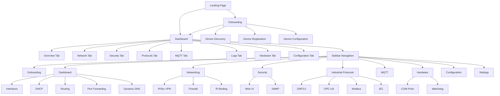

<<<<<<< HEAD
# vista-iot-gateway-frontend
=======

```mermaid
graph TD
    A[Landing Page] --> B[Onboarding]
    A --> C[Dashboard]
    
    B --> B1[Device Discovery]
    B --> B2[Device Registration]
    B --> B3[Device Configuration]
    B --> C
    
    C --> D1[Overview Tab]
    C --> D2[Network Tab]
    C --> D3[Security Tab]
    C --> D4[Protocols Tab]
    C --> D5[MQTT Tab]
    C --> D6[Logs Tab]
    C --> D7[Hardware Tab]
    C --> D8[Configuration Tab]
    
    C --> E[Sidebar Navigation]
    
    E --> E1[Onboarding]
    E --> E2[Dashboard]
    E --> E3[Networking]
    E --> E4[Security]
    E --> E5[Industrial Protocols]
    E --> E6[MQTT]
    E --> E7[Hardware]
    E --> E8[Configuration]
    E --> E9[Settings]
    
    E2 --> E2.1[Interfaces]
    E2 --> E2.2[DHCP]
    E2 --> E2.3[Routing]
    E2 --> E2.4[Port Forwarding]
    E2 --> E2.5[Dynamic DNS]
    
    E3 --> E3.1[IPSec VPN]
    E3 --> E3.2[Firewall]
    E3 --> E3.3[IP Binding]
    
    E4 --> E4.1[Web UI]
    E4 --> E4.2[SNMP]
    
    E5 --> E5.1[DNP3.0]
    E5 --> E5.2[OPC-UA]
    E5 --> E5.3[Modbus]
    E5 --> E5.4[IEC]
    
    E7 --> E7.1[COM Ports]
    E7 --> E7.2[Watchdog]
```
>>>>>>> 493d65f (Initial Commit)
