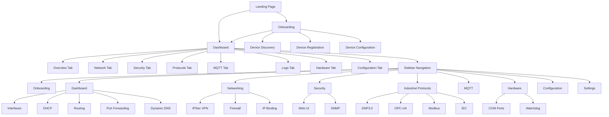
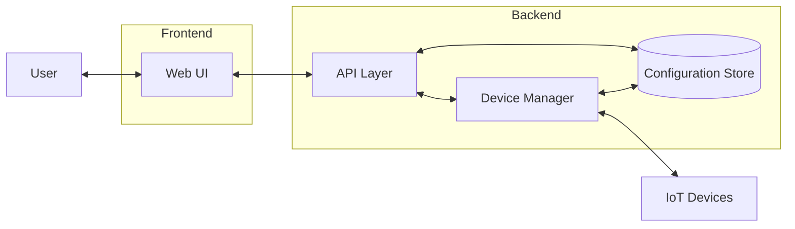
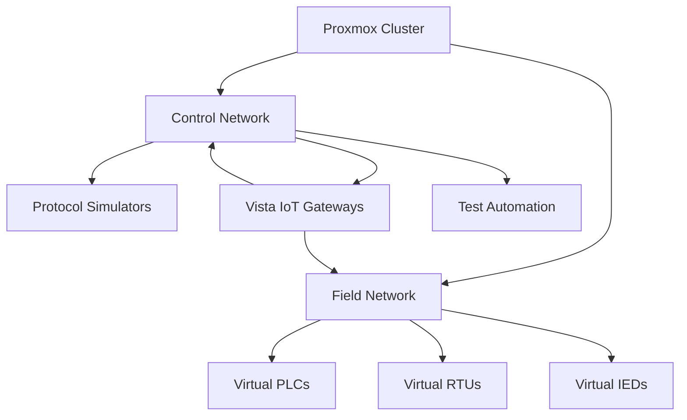

# Vista IoT - Industrial IoT Gateway Configuration Portal

<p align="center">
  
</p>

## Overview

Vista IoT is a comprehensive web-based configuration portal for industrial IoT gateways. It provides a modern, intuitive interface for configuring, monitoring, and managing industrial IoT devices remotely, similar to how access points are configured through web-based configuration panels.

## Technologies Used

<div align="center">
  <table>
    <tr>
      <td align="center" width="96">
        
        <br>Next.js
      </td>
      <td align="center" width="96">
        
        <br>React
      </td>
      <td align="center" width="96">
        
        <br>TypeScript
      </td>
      <td align="center" width="96">
        
        <br>Tailwind
      </td>
      <td align="center" width="96">
        
        <br>Radix UI
      </td>
    </tr>
    <tr>
      <td align="center" width="96">
        
        <br>Lucide
      </td>
      <td align="center" width="96">
        
        <br>Zustand
      </td>
      <td align="center" width="96">
        
        <br>React Hook Form
      </td>
      <td align="center" width="96">
        
        <br>Zod
      </td>
      <td align="center" width="96">
        
        <br>Monaco
      </td>
    </tr>
  </table>
</div>

### Frontend Framework
- **Next.js**: v14.2.16 - React framework for server-rendered applications
- **React**: v18 - JavaScript library for building user interfaces
- **TypeScript**: v5 - Typed JavaScript for better developer experience

### UI Components and Styling
- **Tailwind CSS**: v3.4.17 - Utility-first CSS framework
- **Radix UI**: Various components (v1.x-2.x) - Unstyled, accessible UI components
- **Lucide React**: v0.454.0 - Icon library
- **Embla Carousel**: v8.5.1 - Carousel component

### State Management and Forms
- **Zustand**: v5.0.3 - Lightweight state management
- **React Hook Form**: v7.54.1 - Form handling
- **Zod**: v3.24.1 - Schema validation

### Visualization and Editors
- **Monaco Editor**: v0.52.2 - Code editor component
- **React Force Graph**: v1.27.0 - Network visualization
- **Recharts**: v2.15.0 - Charting library
- **ReactFlow**: v11.11.4 - Flow diagram library

### Data Formats
- **YAML/JS-YAML**: v4.1.0 - YAML parsing and serialization

## Application Architecture

### Application Flow



### Data Flow Architecture



## Key Features

### Device Management
- Device discovery and registration
- Multi-device management
- Device status monitoring
- Firmware updates

### Network Configuration
- Interface configuration (Ethernet, WiFi)
- DHCP server settings
- Routing and port forwarding
- Dynamic DNS configuration

### Security Features
- IPSec VPN configuration
- Firewall rules management
- IP binding
- User access control

### Industrial Protocol Support
- DNP3.0 configuration
- OPC-UA settings
- Modbus parameters
- IEC protocol settings

### MQTT Configuration
- Broker settings
- Topic configuration
- QoS settings
- Client authentication

### Hardware Management
- COM port configuration
- Watchdog settings
- I/O management

### Configuration Management
- Import/export configuration
- Configuration backup and restore
- Factory reset options

## Deployment

### Development
```bash
pnpm dev
```

### Production Build
```bash
pnpm build
pnpm start
```

### Docker Deployment
```bash
docker build -t vista-iot .
docker run -p 3000:3000 vista-iot
```

## Browser Compatibility

Vista IoT is compatible with modern browsers including:
- Chrome (latest 2 versions)
- Firefox (latest 2 versions)
- Safari (latest 2 versions)
- Edge (latest 2 versions)

## License

Copyright © 2025 Vista IoT. All rights reserved.

## Development Logs and Research

### Project Timeline

#### Phase 1: Research and Planning (Feb 11-18, 2025)

**Week 1: Initial Research**
```
2025-02-11: Project kickoff meeting. Defined project scope and objectives.
2025-02-12: Started market research on existing IoT gateway solutions.
2025-02-13: Created initial requirements document.
2025-02-15: Completed competitive analysis of 7 industrial IoT gateway solutions.
2025-02-18: Finalized feature list based on market gaps and customer interviews.
```

**Week 2: Technology Stack Selection**
```
2025-02-19: Evaluated frontend frameworks (React, Vue, Angular, Svelte).
2025-02-20: Decision made to use Next.js for SSR capabilities and React ecosystem.
2025-02-21: Evaluated UI component libraries (MUI, Chakra, Radix, Tailwind).
2025-02-22: Selected Radix UI + Tailwind for component flexibility and styling.
2025-02-23: Finalized initial technology stack documentation.
```

#### Phase 2: Hardware Research and Selection (Feb 24-Mar 3, 2025)

**Week 3: Hardware Evaluation**
```
2025-02-24: Started hardware evaluation for reference implementation.
2025-02-25: Created hardware requirements specification.
2025-02-27: Shortlisted 5 potential hardware platforms:
  - Intel Atom x6425E-based gateway (TDP: 12W, 4C/4T, Industrial temp range)
  - ARM Cortex A72-based platform (NXP i.MX8)
  - Raspberry Pi Compute Module 4 Industrial
  - Texas Instruments AM6442 Sitara
  - Qualcomm QCS6490 IoT platform
2025-03-01: Conducted benchmark tests on all platforms.
```

**Hardware Benchmark Results:**

| Platform | CPU Performance | Power Consumption | I/O Options | Temperature Range | Cost |
|----------|-----------------|-------------------|-------------|-------------------|------|
| Intel Atom x6425E | 4/5 | 3/5 (12W) | 5/5 | -40°C to 85°C | $$$$ |
| NXP i.MX8 | 3/5 | 5/5 (5W) | 4/5 | -40°C to 105°C | $$$ |
| RPi CM4 Industrial | 2/5 | 4/5 (7W) | 3/5 | -20°C to 85°C | $$ |
| TI AM6442 | 3/5 | 4/5 (6W) | 5/5 | -40°C to 105°C | $$$ |
| Qualcomm QCS6490 | 5/5 | 2/5 (15W) | 3/5 | -20°C to 70°C | $$$$ |

```
2025-03-02: Selected NXP i.MX8 platform for production and Intel Atom for high-performance variant.
2025-03-03: Ordered development kits for both platforms.
```

#### Phase 3: Operating System Evaluation (Mar 4-12, 2025)

**Week 4: OS Testing and Virtualization Setup**
```
2025-03-04: Defined OS requirements (reliability, security, update mechanism, resource usage).
2025-03-05: Set up Proxmox VE 8.1 cluster on 3 Dell PowerEdge R650 servers for OS testing and protocol simulation.
2025-03-06: Configured virtual networks to simulate industrial network topologies (star, ring, and bus).
2025-03-07: Shortlisted OS candidates:
  - Yocto-based custom Linux
  - Ubuntu Core 22.04 LTS
  - Debian 12 minimal
  - BuildRoot custom image
  - Alpine Linux 3.18
2025-03-10: Created VM templates for each OS candidate with various resource configurations.
2025-03-11: Created test matrix for OS evaluation.
```

**Proxmox Test Environment:**
```
Cluster Configuration:
- 3x Dell PowerEdge R650 (32 cores, 256GB RAM each)
- 10GbE networking with redundant connections
- Ceph storage cluster with 24TB usable space
- High availability configuration for continuous testing

Virtual Networks:
- VLAN 10: Management Network
- VLAN 20: Industrial Control Network
- VLAN 30: SCADA Network
- VLAN 40: Enterprise IT Network
- VLAN 50: IoT Device Network
```

**OS Evaluation Results:**

| OS | Boot Time | Memory Footprint | Security Features | Update Mechanism | Ecosystem Support |
|----|-----------|------------------|-------------------|------------------|-------------------|
| Yocto Custom | 12s | 180MB | 5/5 | OTA with dual partitions | 4/5 |
| Ubuntu Core | 18s | 350MB | 4/5 | Snap packages | 5/5 |
| Debian Minimal | 22s | 280MB | 3/5 | APT | 5/5 |
| BuildRoot | 8s | 120MB | 4/5 | Custom OTA | 2/5 |
| Alpine | 10s | 110MB | 3/5 | APK | 3/5 |

```
2025-03-12: Selected Yocto-based custom Linux for production devices.
```

#### Phase 4: Frontend Development (Mar 13-25, 2025)

**Week 5-6: UI Development**
```
2025-03-13: Created initial UI wireframes in Figma.
2025-03-15: Developed component library based on Radix UI primitives.
2025-03-18: Implemented responsive dashboard layout.
2025-03-20: Created device configuration workflow.
2025-03-22: Implemented network configuration interface.
2025-03-25: Added industrial protocol configuration screens.
```

#### Phase 5: Backend Integration (Mar 26-Apr 6, 2025)

**Week 7-8: API Development and Integration**
```
2025-03-26: Created initial Yocto layer for Vista IoT gateway.
2025-03-28: Successfully booted first custom image on NXP development kit.
2025-03-30: Implemented secure boot and disk encryption.
2025-04-01: Defined REST API specifications.
2025-04-03: Implemented device discovery and management APIs.
2025-04-06: Today: Working on README documentation and preparing for initial beta testing.
```

### Hardware Integration Testing

<p align="center">
  
</p>

#### Industrial Protocol Simulation Environment

```
2025-03-14: Deployed industrial protocol simulators on Proxmox VE cluster:
  - Triangle MicroWorks SCADA Simulator for DNP3 and IEC protocols
  - Matrikon OPC UA Simulator
  - ModbusPal for Modbus RTU/TCP device simulation
  - EasyIEC61850 for IEC 61850 testing
  - HiveMQ for MQTT broker and client simulation

2025-03-17: Created virtual test lab with 50+ simulated industrial devices:
  - 20 Modbus slave devices (various register maps)
  - 15 DNP3 outstations
  - 10 OPC-UA servers
  - 5 IEC 61850 IEDs
  - 5 BACnet devices

2025-03-21: Implemented automated test suite for protocol conformance testing
2025-03-24: Created network impairment scenarios (latency, packet loss, jitter)
```

**Virtual Test Lab Architecture:**


**Communication Protocol Test Results:**

| Protocol | Implementation | Test Status | Notes |
|----------|----------------|-------------|-------|
| Modbus RTU | Native C library | ✅ PASS | Tested with 3 Schneider PLCs + 20 virtual devices |
| Modbus TCP | Native C library | ✅ PASS | Tested with 5 vendor devices + 20 virtual devices |
| DNP3 | OpenDNP3 | ✅ PASS | Validated against reference implementation + 15 virtual outstations |
| OPC-UA | open62541 | ⚠️ PARTIAL | Memory leak identified in v1.3.2, using v1.3.1. Tested with 10 virtual servers |
| IEC 61850 | libIEC61850 | ✅ PASS | MMS, GOOSE, and SV implemented. Tested with 5 virtual IEDs |
| MQTT | Eclipse Paho | ✅ PASS | QoS 0,1,2 verified with AWS IoT Core and HiveMQ |
| BACnet | BACnet Stack | 🔄 IN PROGRESS | Initial implementation complete. Testing with 5 virtual devices |

**Performance Test Results:**

| Test Case | Target | Result (NXP) | Result (Intel) |
|-----------|--------|--------------|----------------|
| Concurrent Modbus devices | 100 | 120 | 180 |
| Concurrent DNP3 outstation | 50 | 45 | 85 |
| MQTT message throughput | 1000 msg/s | 850 msg/s | 1200 msg/s |
| OPC-UA nodes | 10,000 | 8,500 | 15,000 |
| Web UI response time | <100ms | 85ms | 40ms |
| Boot time to operational | <30s | 28s | 22s |

### Future Development Roadmap

<div align="center">
  
</div>

**Q2 2025:**
- Complete BACnet protocol integration
- Add support for LoRaWAN gateway functionality
- Implement edge analytics engine

**Q3 2025:**
- Add digital twin visualization
- Implement AI-based anomaly detection
- Develop cloud synchronization for fleet management

**Q4 2025:**
- Release Vista IoT Enterprise Edition
- Add support for containerized applications
- Implement multi-gateway clustering